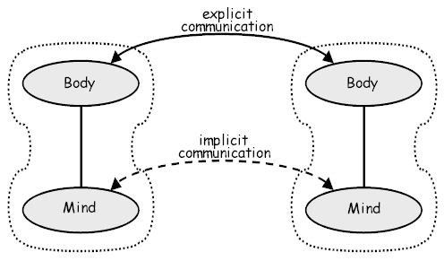
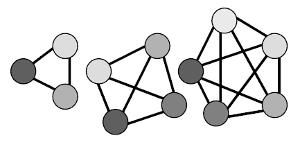

# Design Principles Behind Smalltalk

Daniel H. H. Ingalls
Learning Research Group
Xerox Palo Alto Research Center

BYTE Magazine, August 1981. (c) by The McGraw-Hill Companies, Inc., NY.

The purpose of the Smalltalk project is to provide computer support for the creative spirit in everyone. Our work flows from a vision that includes a creative individual and the best computing hardware available. We have chosen to concentrate on two principle areas of research: a language of description (programming language) that serves as an interface between the models in the human mind and those in computing hardware, and a language of interaction (user interface) that matches the human communication system to that of the computer. Our work has followed a two- to four-year cycle that can be seen to parallel the scientific method:

* Build an application program within the current system (make an observation)
* Based on that experience, redesign the language (formulate a theory)
* Build a new system based on the new design (make a prediction that can be tested)

The Smalltalk-80 system marks our fifth time through this cycle. In this article, I present some of the general principles we have observed in the course of our work. While the presentation frequently touches on Smalltalk "motherhood", the principles themselves are more general and should prove useful in evaluating other systems and in guiding future work. 

Just to get warmed up, I'll start with a principle that is more social than technical and that is largely responsible for the particular bias of the Smalltalk project:

> **Personal Mastery:** If a system is to serve the creative spirit, it must be entirely comprehensible to a single individual.

The point here is that the human potential manifests itself in individuals. To realize this potential, we must provide a medium that can be mastered by a single individual. Any barrier that exists between the user and some part of the system will eventually be a barrier to creative expression. Any part of the system that cannot be changed or that is not sufficiently general is a likely source of impediment. If one part of the system works differently from all the rest, that part will require additional effort to control. Such an added burden may detract from the final result and will inhibit future endeavors in that area. We can thus infer a general principle of design:

> **Good Design:** A system should be built with a minimum set of unchangeable parts; those parts should be as general as possible; and all parts of the system should be held in a uniform framework.

### Language 

In designing a language for use with computers, we do not have to look far to find helpful hints. Everything we know about how people think and communicate is applicable. The mechanisms of human thought and communication have been engineered for millions of years, and we should respect them as being of sound design. Moreover, since we must work with this design for the next million years, it will save time if we make our computer models compatible with the mind, rather that the other way around.

Figure 1 illustrates the principle components in our discussion. A person is presented as having a body and a mind. The body is the site of primary experience, and, in the context of this discussion, it is the physical channel through which the universe is perceived and through which intentions are carried out. Experience is recorded and processed in the mind. Creative thought (without going into its mechanism) can be viewed as the spontaneous appearance of information in the mind. Language is the key to that information:

> **Purpose of Language:** To provide a framework for communication.

The interaction between two individuals is represented in figure 1 as two arcs. The solid arc represents explicit communication: the actual words and movements uttered and perceived. The dashed arc represents implicit communication: the shared culture and experience that form the context of the explicit communication. In human interaction, much of the actual communication is achieved through reference to shared context, and human language is built around such allusion. This is the case with computers as well.

It is no coincidence that a computer can be viewed as one of the participants in figure 1. In this case, the "body" provides for visual display of information and for sensing input from a human user. The "mind" of a computer includes the internal memory and processing elements and their contents. Figure 1 shows that several different issues are involved in the design of a computer language:

> **Scope:** The design of a language for using computers must deal with internal models, external media, and the interaction between these in both the human and the computer.

This fact is responsible for the difficulty of explaining Smalltalk to people who view computer languages in a more restricted sense. Smalltalk is not simply a better way of organizing procedures or a different technique for storage management. It is not just an extensible hierarchy of data types, or a graphical user interface. It is all of these things and anything else that is needed to support the interactions shown in figure 1. 

 

> **Figure 1:** The scope of language design. Communication between two people (or between one person and a computer) includes communication on two levels. Explicit communication includes the information that is transmitted in a given message. Implicit communication includes the relevant assumptions common to the two beings.

### Communicating Objects 

The mind observes a vast universe of experience, both immediate and recorded. One can derive a sense of oneness with the universe simply by letting this experience be, just as it is. However, if one wishes to participate, literally to take a part, in the universe, one must draw distinctions. In so doing one identifies an object in the universe, and simultaneously all the rest becomes not-that-object. Distinction by itself is a start, but the process of distinguishing does not get any easier. Every time you want to talk about "that chair over there", you must repeat the entire processes of distinguishing that chair. This is where the act of reference comes in: we can associate a unique identifier with an object, and, from that time on, only the mention of that identifier is necessary to refer to the original object.

We have said that a computer system should provide models that are compatible with those in the mind. Therefore:

> **Objects:** A computer language should support the concept of "object" and provide a uniform means for referring to the objects in its universe.

The Smalltalk storage manager provides an object-oriented model of memory for the entire system. Uniform reference is achieved simply by associating a unique integer with every object in the system. This uniformity is important because it means that variables in the system can take on widely differing values and yet can be implemented as simple memory cells. Objects are created when expressions are evaluated, and they can be passed around by uniform reference, so that no provision for their storage is necessary in the procedures that manipulate them. When all references to an object have disappeared from the system, the object itself vanishes, and its storage is reclaimed. Such behavior is essential to full support of the object metaphor:

> **Storage Management:** To be truly "object-oriented", a computer system must provide automatic storage management.

A way to find out if a language is working well is to see if programs look like they are doing what they are doing. If they are sprinkled with statements that relate to the management of storage, then their internal model is not well matched to that of humans. Can you imagine having to prepare someone for each thing you tell them or having to inform them when you are through with a given topic and that it can be forgotten?

Each object in our universe has a life of its own. Similarly, the brain provides for independent processing along with storage of each mental object. This suggests a third principle of design:

> **Messages:** Computing should be viewed as an intrinsic capability of objects that can be uniformly invoked by sending messages.

Just as programs get messy if object storage is dealt with explicitly, control in the system becomes complicated if processing is performed extrinsically. Let us consider the process of adding 5 to a number. In most computer systems, the compiler figures out what kind of number it is and generates code to add 5 to it. This is not good enough for an object-oriented system because the exact kind of number cannot be determined by the compiler (more on this later). A possible solution is to call a general addition routine that examines the type of the arguments to determine the approximate action. This is not a good approach because it means that this critical routine must be edited by novices who just want to experiment with their own class of numbers. It is also a poor design because intimate knowledge about the internals of objects is sprinkled throughout the system.

Smalltalk provides a much cleaner solution: it sends the name of the desired operation, along with any arguments, as a message to the number, with the understanding that the receiver knows best how to carry out the desired operation. Instead of a bit-grinding processor raping and plundering data structures, we have a universe of well-behaved objects that courteously ask each other to carry out their various desires. The transmission of messages is the only process that is carried on outside of objects and this is as it should be, since messages travel between objects. The principle of good design can be restated for languages:

> **Uniform Metaphor:** A language should be designed around a powerful metaphor that can be uniformly applied in all areas.

Examples of success in this area include LISP, which is built on the model of linked structures; APL, which is built on the model of arrays; and Smalltalk, which is built on the model of communicating objects. In each case, large applications are viewed in the same way as the fundamental units from which the system is built. In Smalltalk especially, the interaction between the most primitive objects is viewed in the same way as the highest-level interaction between the computer and its user. Every object in Smalltalk, even a lowly integer, has a set of messages, a protocol, that defines the explicit communication to which that object can respond. Internally, objects may have local storage and access to other shared information which comprise the implicit context of all communication. For instance, the message + 5 (add five) carries an implicit assumption that the augend is the present value of the number receiving the message.

### Organization 

A uniform metaphor provides a framework in which complex systems can be built. Several related organizational principles contribute to the successful management of complexity. To begin with:

> **Modularity:** No component in a complex system should depend on the internal details of any other component.

 

> **Figure 2:** System complexity. As the number of components in a system increases, the chances for unwanted interaction increase rapidly. Because of this, a computer language should be designed to minimize the possibilities of such interdependence.

This principle is depicted in figure 2. If there are N components in a system, then there are roughly N-squared potential dependencies between them. If computer systems are ever to be of assistance in complex human tasks, they must be designed to minimize such interdependence. The message-sending metaphor provides modularity by decoupling the intent of a message (embodied in its name) from the method used by the recipient to carry out the intent. Structural information is similarly protected because all access to the internal state of an object is through this same message interface.

The complexity of a system can often be reduced by grouping similar components. Such grouping is achieved through data typing in conventional programming languages, and through classes in Smalltalk. A class describes other objects -- their internal state, the message protocol they recognize, and the internal methods for responding to those messages. The objects so described are called instances of that class. Even classes themselves fit into this framework; they are just instances of class Class, which describes the appropriate protocol and implementation for object description.

> **Classification:** A language must provide a means for classifying similar objects, and for adding new classes of objects on equal footing with the kernel classes of the system.

Classification is the objectification of nessness. In other words, when a human sees a chair, the experience is taken both literally an "that very thing" and abstractly as "that chair-like thing". Such abstraction results from the marvelous ability of the mind to merge "similar" experience, and this abstraction manifests itself as another object in the mind, the Platonic chair or chairness.

Classes are the chief mechanism for extension in Smalltalk. For instance, a music system would be created by adding new classes that describe the representation and interaction protocol of Note, Melody, Score, Timbre, Player, and so on. The "equal footing" clause of the above principle is important because it insures that the system will be used as it was designed. In other words, a melody could be represented as an ad hoc collection of Integers representing pitch, duration, and other parameters, but if the language can handle Notes as easily as Integers, then the user will naturally describe a melody as a collection of Notes. At each stage of design, a human will naturally choose the most effective representation if the system provides for it. The principle of modularity has an interesting implication for the procedural components in a system:

> **Polymorphism:** A program should specify only the behavior of objects, not their representation.

A conventional statement of this principle is that a program should never declare that a given object is a SmallInteger or a LargeInteger, but only that it responds to integer protocol. Such generic description is crucial to models of the real world.

Consider an automobile traffic simulation. Many procedures in such a system will refer to the various vehicles involved. Suppose one wished to add, say, a street sweeper. Substantial amounts of computation (in the form of recompiling) and possible errors would be involved in making this simple extension if the code depended on the objects it manipulates. The message interface establishes an ideal framework for such an extension. Provided that street sweepers support the same protocol as all other vehicles, no changes are needed to include them in the simulation:

> **Factoring:** Each independent component in a system would appear in only one place.

There are many reasons for this principle. First of all, it saves time, effort, and space if additions to the system need only be made in one place. Second, users can more easily locate a component that satisfies a given need. Third, in the absence of proper factoring, problems arise in synchronizing changes and ensuring that all interdependent components are consistent. You can see that a failure in factoring amounts to a violation of modularity.

Smalltalk encourages well-factored designs through inheritance. Every class inherits behavior from its superclass. This inheritance extends through increasingly general classes, ultimately ending with class Object which describes the default behavior of all objects in the system. In our traffic simulation above, StreetSweeper (and all other vehicle classes) would be described as a subclass of a general Vehicle class, thus inheriting appropriate default behavior and avoiding repetition of the same concepts in many different places. Inheritance illustrates a further pragmatic benefit of factoring:

> **Leverage:** When a system is well factored, great leverage is available to users and implementers alike.

Take the case of sorting an ordered collection of objects. In Smalltalk, the user would define a message called sort in the class OrderedCollection. When this has been done, all forms of ordered collections in the system will instantly acquire this new capability through inheritance. As an aside, it is worth noting that the same method can alphabetize text as well as sort numbers, since comparison protocol is recognized by the classes which support both text and numbers.

The benefits of structure for implementers are obvious. To begin with, there will be fewer primitives to implement. For instance, all graphics in Smalltalk are performed with a single primitive operation. With only one task to do, an implementer can bestow loving attention on every instruction, knowing that each small improvement in efficiency will be amplified throughout the system. It is natural to ask what set of primitive operations would be sufficient to support an entire computing system. The answer to this question is called a virtual machine specification:

> **Virtual Machine:** A virtual machine specification establishes a framework for the application of technology.

The Smalltalk virtual machine establishes an object-oriented model for storage, a message-oriented model for processing, and a bitmap model for visual display of information. Through the use of microcode, and ultimately hardware, system performance can be improved dramatically without any compromise to the other virtues of the system.

### User Interface 

A user interface is simply a language in which most of the communication is visual. Because visual presentation overlaps heavily with established human culture, esthetics plays a very important role in this area. Since all capability of a computer system is ultimately delivered through the user interface, flexibility is also essential here. An enabling condition for adequate flexibility of a user interface can be stated as an object-oriented principle:

> **Reactive Principle:** Every component accessible to the user should be able to present itself in a meaningful way for observation and manipulation.

This criterion is well supported by the model of communicating objects. By definition, each object provides an appropriate message protocol for interaction. This protocol is essentially a microlanguage particular to just that kind of object. At the level of the user interface, the appropriate language for each object on the screen is presented visually (as text, menus, pictures) and sensed through keyboard activity and the use of a pointing device.

It should be noted that operating systems seem to violate this principle. Here the programmer has to depart from an otherwise consistent framework of description, leave whatever context has been built up, and deal with an entirely different and usually very primitive environment. This need not be so:

> **Operating System:** An operating system is a collection of things that don't fit into a language. There shouldn't be one.

Here are some examples of conventional operating system components that have been naturally incorporated into the Smalltalk language:

* Storage management -- Entirely automatic. Objects are created by a message to their class and reclaimed when no further references to them exist. Expansion of the address space through virtual memory is similarly transparent.
* File system -- Included in the normal framework through objects such as Files and Directories with message protocols that support file access.
* Display handling -- The display is simply an instance of class Form, which is continually visible, and the graphical manipulation messages defined in that class are used to change the visible image.
* Keyboard Input -- The user input devices are similarly modeled as objects with appropriate messages for determining their state or reading their history as a sequence of events.
* Access to subsystems -- Subsystems are naturally incorporated as independent objects within Smalltalk: there they can draw on the large existing universe of description, and those that involve interaction with the user can participate as components in the user interface.
* Debugger -- The state of the Smalltalk processor is accessible as an instance of class Process that owns a chain of stack frames. The debugger is just a Smalltalk subsystem that has access to manipulate the state of a suspended process. It should be noted that nearly the only run-time error that can occur in Smalltalk is for a message not to be recognized by its receiver.

Smalltalk has no "operation system" as such. The necessary primitive operations, such as reading a page from the disk, are incorporated as primitive methods in response to otherwise normal Smalltalk messages.

### Future Work 

As might be expected, work remains to be done on Smalltalk. The easiest part to describe is the continued application of the principles in this paper. For example, the Smalltalk-80 system falls short in its factoring because it supports only hierarchical inheritance. Future Smalltalk systems will generalize this model to arbitrary (multiple) inheritance. Also, message protocols have not been formalized. The organization provides for protocols, but it is currently only a matter of style for protocols to be consistent from one class to another. This can be remedied easily by providing proper protocol objects that can be consistently shared. This will then allow formal typing of variables by protocol without losing the advantages of polymorphism.

The other remaining work is less easy to articulate. There are clearly other aspects to human thought that have not been addressed in this paper. These must be identified as metaphors that can complement the existing models of the language.

Sometimes the advance of computer systems seems depressingly slow. We forget that steam engines were high-tech to our grandparents. I am optimistic about the situation. Computer systems are, in fact, getting simpler and, as a result, more usable. I would like to close with a general principle which governs this process:

> **Natural Selection:** Languages and systems that are of sound design will persist, to be supplanted only by better ones.

Even as the clock ticks, better and better computer support for the creative spirit is evolving. Help is on the way.